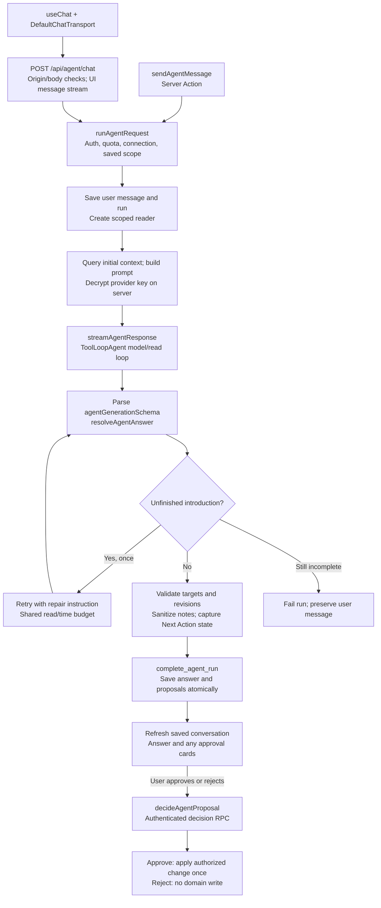
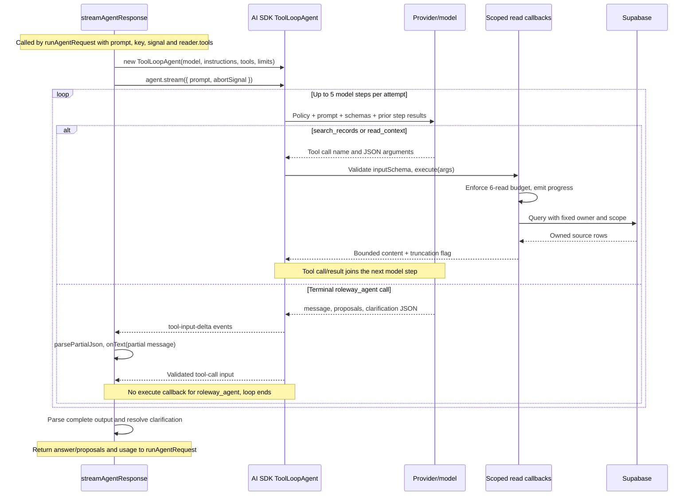
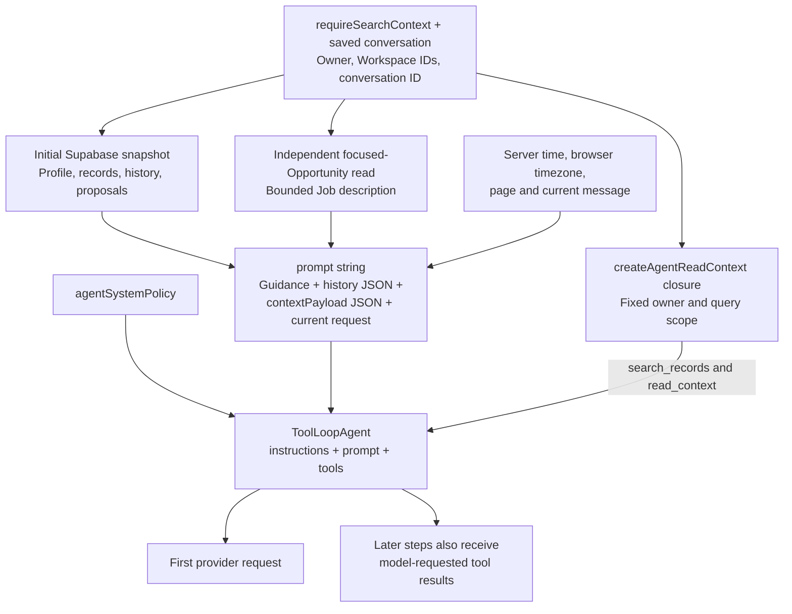
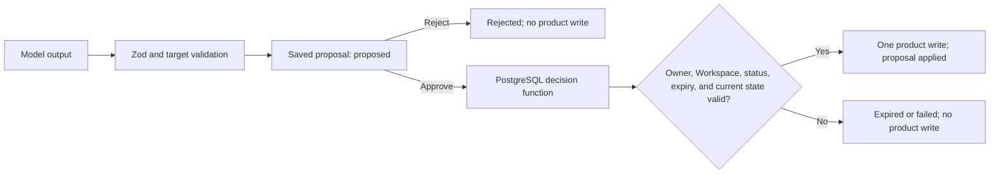

# How Roleway Agent works

Roleway Agent answers questions from a bounded snapshot and scoped, on-demand reads of the signed-in person's Account or one Workspace. It can draft text and propose four internal changes. A proposal becomes a record only after the person approves it and the database applies it. The application remains useful when no AI provider is connected.

## What a person sees

1. In Settings → Agent, connect and test a personal API provider. Roleway encrypts the key before saving it.
2. Start a conversation from Agent for account-wide context, or from a Workspace or Opportunity for a fixed, narrower scope. The `+` and `/` picker offers Create and Explore prompts; typing filters them, and the selected prompt remains editable before sending.
3. Agent may ask for missing details, stream an answer, and show a review card for any proposed change. The answer and run progress are saved with the conversation.
4. Approve or reject each proposal. A successful approval shows the saved result and a link to open it; rejection leaves product records unchanged. Saved conversations can be resumed or archived. Messages show timestamps and can be copied.

This shows the successful path and the one answer-repair branch. Provider, validation, or persistence failures after the run starts enter the failed-run path. The detailed SDK loop and context inputs are shown below.

The stream is feedback, not proof of a saved answer or applied change. On interruption, the user can reload the saved conversation to inspect the run and its result.

## Code and libraries

| Part              | Implementation                                                                                                                                                                                                |
| ----------------- | ------------------------------------------------------------------------------------------------------------------------------------------------------------------------------------------------------------- |
| Chat UI           | `apps/web/src/features/agent/live-chat.tsx` and `apps/web/src/components/agent-popover-launcher.tsx`; `@ai-sdk/react` `useChat`, AI SDK transport, and Markdown rendering                                     |
| Request boundary  | `apps/web/src/app/api/agent/chat/route.ts`; same-origin check, request limit, AI SDK UI message stream                                                                                                        |
| Run orchestration | `apps/web/src/features/agent/run-request.ts`; auth, scope, quota, context, provider call, validation, persistence, and redacted errors                                                                        |
| Model integration | `apps/web/src/lib/ai/stream-agent.ts` uses `ai` `ToolLoopAgent` with `@ai-sdk/openai`, `@ai-sdk/anthropic`, and `@ai-sdk/google`; `providers.ts` contains shared policy and the non-streaming Server Action path |
| Approval action   | `apps/web/src/app/(app)/agent/actions.ts` calls the authenticated decision function and opens verified results                                                                                                |
| Credentials       | `apps/web/src/lib/ai/secrets.ts` encrypts provider keys with Node crypto; Settings tests the connection through `generateAssistantOutput`                                                                     |
| Contracts         | `packages/schemas` defines the four allowed proposal types and validates the model response with Zod; `packages/core` contains general shared workflow rules                                                  |
| Persistence       | Supabase client and SQL migrations in `supabase/migrations`; PostgreSQL functions save completed runs and decide proposals                                                                                    |

The dependency versions are in [`STACK.md`](../STACK.md). The Create and Explore catalog is in `apps/web/src/features/agent/capabilities.ts`; the detailed behavior contract is [`ROLEWAY-AGENT.md`](ROLEWAY-AGENT.md).

## Inside the Vercel AI SDK loop

[`stream-agent.ts`](../apps/web/src/lib/ai/stream-agent.ts) constructs a `ToolLoopAgent`. Roleway owns authentication, context selection, persistence, and approval; the SDK manages model steps and dispatches the read tools' `execute` callbacks. The selected provider runs the model. The model supplies a tool name and JSON arguments, not executable JavaScript or SQL.

The diagram follows a valid read or terminal call. Invalid arguments, provider errors, aborts, multiple terminal response calls, and truncated output fail the request. Returning a read result does not grant permission to write.

### Three SDK tools, four proposal types

| Model-visible SDK tool | Input | What runs on the server |
| --- | --- | --- |
| `search_records` | `{ kind, query, offset }`; Opportunities, Jobs, or documents | `tool({ inputSchema: agentSearchInputSchema, execute })` searches owned metadata in [`read-context.ts`](../apps/web/src/features/agent/read-context.ts). |
| `read_context` | `{ kind, id, offset }`; Opportunity, Job, document, Career Profile, or conversation | `tool({ inputSchema: agentReadInputSchema, execute })` reads source text or history using the same fixed scope. |
| `roleway_agent` | `{ message, proposals, clarification }` via `agentGenerationSchema` | No `execute` function. This is the terminal structured answer. Roleway parses it and resolves clarification before saving. |

The four names inside `proposals`—`create_workspace`, `create_task`, `set_next_action`, and `create_note`—are **data in the terminal tool's arguments**, not four SDK tools. The model cannot directly invoke their database mutations. A `create_task` proposal requests an approval card; only a later user approval can execute it.

`clarification` is a required nullable decision naming the first missing detail. When non-null, `resolveAgentAnswer` replaces the model's prose with a concrete question and discards all accompanying proposals. When null, the answer must be non-empty. The persisted contract is `{ message, proposals }`; the provider-only `clarification` field is not stored in that response. Each proposal has `tool`, `summary`, nullable `targetId`, `title`, `body`, `dueAt`, `name`, `objective`, and optional `supersedesProposalId`; Zod enforces the fields required by each type. At most four proposals are allowed.

### Loop and request limits

| Setting | Current implementation |
| --- | --- |
| Model steps | `stopWhen: [isStepCount(5), hasToolCall("roleway_agent")]`. A terminal tool with no `execute` also naturally ends the SDK loop. |
| Tool selection | `toolChoice: "required"` when read tools are present. `prepareStep`, at zero-based `stepNumber >= 4`, makes only `roleway_agent` active and forces it. |
| Read calls | Six model-invoked reads across the original attempt and optional repair, enforced by the same reader closure. Initial snapshot queries and the separately fetched focused Opportunity are outside this counter. |
| Read size | Up to 12 rows per paginated collection, with a lookahead row to compute `nextOffset`; each returned content string is capped at 24,000 characters. Individual source fields have additional caps. |
| Output and retries | `maxOutputTokens: 3000` per model call; `maxRetries: 0`. Roleway may make one fresh SDK attempt only for its narrowly detected unfinished-introduction case. |
| Time | `runAgentRequest` shares a 240-second generation deadline across attempts. Each SDK attempt also has a 240-second OpenRouter or 45-second other-provider timeout. The route's `maxDuration` is 300 seconds. |

The repair attempt reuses the original prompt plus a repair instruction, the same reader, and the remaining deadline. It does not resume the previous attempt's in-memory SDK messages. Retrieved tool-call/result messages inform later steps within an attempt; Roleway stores progress labels and the final answer/proposals, not a replayable SDK tool transcript.

### Provider adapters and the browser stream

OpenAI uses `createOpenAI(...).chat(model)`; OpenRouter and validated OpenAI-compatible endpoints use that same chat adapter with a different `baseURL`. Anthropic uses `createAnthropic(...)(model)` and Gemini uses `createGoogleGenerativeAI(...)(model)`. These adapters translate the SDK's tool schemas and messages into the provider protocol. The key remains server-side, requests do not follow redirects, and compatible endpoints are validated before use.

The provider stream and the browser stream are separate. `streamAgentResponse` consumes SDK tool-input events, extracts partial `message` text with `parsePartialJson`, and calls `onText`. [`route.ts`](../apps/web/src/app/api/agent/chat/route.ts) wraps Roleway events with `createUIMessageStream` / `createUIMessageStreamResponse`: `data-started` carries conversation/run IDs, `data-progress` carries step labels, `data-answer` replaces the displayed answer text, and `data-result` carries the saved conversation URL. [`live-chat.tsx`](../apps/web/src/features/agent/live-chat.tsx) consumes those parts through `useChat` and refreshes or navigates on completion. It does not send the entire client transcript as authoritative model context; the server reloads owned history.

The `sendAgentMessage` Server Action calls the same `runAgentRequest`. Its `generateAgentResponse` fallback delegates to `streamAgentResponse` when the reader is supplied, with a no-op text callback. Thus it uses the same model/read loop without streaming answer updates to the browser.

Settings → Test connection is a separate `generateAssistantOutput` request for a small structured draft. It does not use this conversation pipeline or verify product writes. Older low-level provider adapters remain unit-tested, but application conversations use the read-enabled SDK path.

## Features available today

Create exposes exactly four proposal types, listed below. The model asks for missing details one question at a time and can revise a proposal after a correction. Each proposal has its own approval decision. A correction includes `supersedesProposalId`; completion atomically retires that exact owned, pending proposal and saves the replacement. Unrelated proposals remain available. Approval and completion lock the conversation so a simultaneous approval/revision cannot apply a retired version.

Explore has nine read-and-draft starting points:

| Explore prompt       | Uses the available snapshot to...                                         |
| -------------------- | ------------------------------------------------------------------------- |
| Today & follow-ups   | Surface due tasks, Next Actions, interviews, and contact follow-ups       |
| Workspaces           | Summarize search objectives and preferences                               |
| Opportunities        | Review active stages, priorities, and missing Next Actions                |
| Jobs                 | Review captured Inbox listings awaiting attention                         |
| Tasks                | Prioritize outstanding Opportunity work                                   |
| Interviews           | Draft preparation topics and questions                                    |
| Contacts             | Review relationships and draft follow-up text                             |
| Documents            | Review document inventory and draft text after requesting missing content |
| Career Profile & fit | Compare supplied career facts with a role and flag evidence gaps          |

Explore has no write or send action. Follow-up text, interview preparation, fit explanations, and application plans stay in the transcript for the person to review and use.

## How context reaches the model

[`run-request.ts`](../apps/web/src/features/agent/run-request.ts) calls `requireSearchContext()` to establish the owner and available Workspaces. New conversations resolve Account or Workspace scope from their starting point; existing conversations reuse their saved scope. Connection ownership, conversation ownership, and focused-Opportunity ownership are checked before generation.

| Initial context | Selection and bounds |
| --- | --- |
| Career Profile and preferences | Account-wide stored basics, target roles, technologies, location/remote preferences, compensation, and exclusions. |
| Workspaces | Metadata for the server-resolved scope. Archived Workspaces are excluded by the context boundary. |
| Opportunities and tasks | Up to 100 active Opportunities and 100 outstanding tasks. Non-focused Job descriptions are omitted. |
| Focused Opportunity | Loaded independently, even outside the 100-record snapshot; includes up to 12,000 characters of plain-text Job description. |
| Jobs, interviews, contacts, documents | Up to 60 each: Inbox Jobs, scheduled interviews, contacts ordered by follow-up date, and document metadata. Document bodies require a read tool. |
| Conversation | Latest 12 messages, reversed into chronological order, each capped at 6,000 characters. This is embedded in the prompt as JSON. |
| Proposals | Latest 20 summaries/states; argument details are included only for entries among the latest four that pass schema validation. |
| Request context | Personal guidance, current server time, browser timezone, saved scope/page, current message, and explicit descriptions of context limits. |

On-demand reads can search Opportunities/Jobs/documents, retrieve Job or document source text, read notes/activity through an owned Opportunity, and page earlier messages in the current conversation. The callbacks capture `userId`, `workspaceIds`, and `conversationId`; the model cannot override them. Reads use authenticated Supabase queries and RLS. The model gets tool results, not database credentials.

This is explicit database retrieval with bounded context, not a vector/embedding retrieval pipeline. Career Profile has no separate structured Career Evidence store. Approved documents can supply further evidence; drafts are not approved facts. Retrieved content and personal guidance remain untrusted data and cannot override the system policy or approval boundary.

## What approval can do

| Proposal           | Required details                                  | Applied change              |
| ------------------ | ------------------------------------------------- | --------------------------- |
| `create_workspace` | Workspace name and search objective               | Creates a focused Workspace |
| `create_task`      | Exact Opportunity and task title; date optional   | Creates an Opportunity task |
| `set_next_action`  | Exact Opportunity and action title; date optional | Updates its Next Action     |
| `create_note`      | Exact Opportunity and note body                   | Creates an Opportunity note |

Approval uses the signed-in user's database session. The transaction locks the proposal, checks ownership and its destination Workspace, and prevents repeat application. Proposals expire after seven days. A Next Action approval also compares the value and due date captured when the proposal was made, so it cannot overwrite a later manual edit. Agent cannot create Jobs, Opportunities, applications, contacts, interviews, or documents; it cannot submit applications, send messages, or contact employers. Explore drafts remain text for the person to review and use.

## Data, safety, and failure states

- `ai_connections` stores encrypted provider credentials using AES-256-GCM with a server-only key. `agent_conversations`, `agent_messages`, `ai_runs`, `agent_run_steps`, and `agent_proposals` store the durable conversation and review state.
- Row Level Security, relationship triggers, Workspace checks, and protected database functions enforce ownership beyond UI visibility. Provider text and captured Job content are treated as untrusted data.
- The server checks a 30-runs-per-hour limit before starting a run. This count is not an atomic reservation, so simultaneous requests can race.
- Failed provider calls or invalid output mark the run failed and preserve the user's message for retry. System events record redacted error codes, not prompts, keys, Job descriptions, or provider payloads.
- A provider fixture proves the application flow, while a live provider test is needed to verify real model behavior. Browser tests use disposable Supabase accounts; `agent-live.spec.ts` requires an opt-in provider key. `pnpm --filter @roleway/web test:agent:live` runs synthetic grounding, missing-information, date, retrieval/injection, history, and multi-turn correction evaluations, recording latency and token usage without credentials. See [`DEPLOYMENT_AND_RELEASES.md`](DEPLOYMENT_AND_RELEASES.md) for that boundary.
