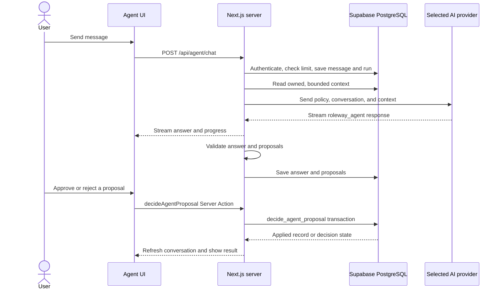
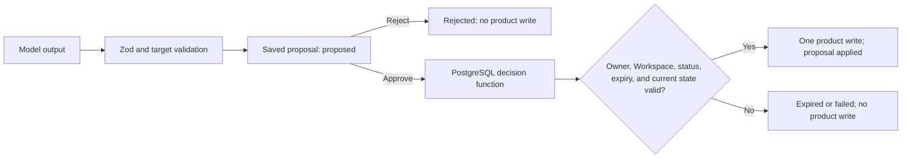

# How Roleway Agent works

Roleway Agent answers questions from a bounded snapshot of the signed-in person's Account or one Workspace. It can draft text and propose four internal changes. A proposal becomes a record only after the person approves it and the database applies it. The application remains useful when no AI provider is connected.

## What a person sees

1. In Settings → Agent, connect and test a personal API provider. Roleway encrypts the key before saving it.
2. Start a conversation from Agent for account-wide context, or from a Workspace or Opportunity for a fixed, narrower scope. The `+` and `/` picker offers Create and Explore prompts; typing filters them, and the selected prompt remains editable before sending.
3. Agent may ask for missing details, stream an answer, and show a review card for any proposed change. The answer and run progress are saved with the conversation.
4. Approve or reject each proposal. A successful approval shows the saved result and a link to open it; rejection leaves product records unchanged. Saved conversations can be resumed or archived. Messages show timestamps and can be copied.

The stream is feedback, not proof of a saved answer or applied change. On interruption, the user can reload the saved conversation to inspect the run and its result.

## Code and libraries

| Part              | Implementation                                                                                                                                                                                                |
| ----------------- | ------------------------------------------------------------------------------------------------------------------------------------------------------------------------------------------------------------- |
| Chat UI           | `apps/web/src/features/agent/live-chat.tsx` and `apps/web/src/components/agent-popover-launcher.tsx`; `@ai-sdk/react` `useChat`, AI SDK transport, and Markdown rendering                                     |
| Request boundary  | `apps/web/src/app/api/agent/chat/route.ts`; same-origin check, request limit, AI SDK UI message stream                                                                                                        |
| Run orchestration | `apps/web/src/features/agent/run-request.ts`; auth, scope, quota, context, provider call, validation, persistence, and redacted errors                                                                        |
| Model integration | `apps/web/src/lib/ai/stream-agent.ts` uses `ai` `ToolLoopAgent` with `@ai-sdk/openai`, `@ai-sdk/anthropic`, and `@ai-sdk/google`; `providers.ts` contains shared policy and the non-streaming Server Action path |
| Approval action   | `apps/web/src/app/(app)/agent/actions.ts` calls the authenticated decision function and opens verified results                                                                                                |
| Credentials       | `apps/web/src/lib/ai/secrets.ts` encrypts provider keys with Node crypto; Settings tests the connection through `generateAssistantOutput`                                                                     |
| Contracts         | `packages/schemas` defines the four allowed proposal types and validates the model response with Zod; `packages/core` contains general shared workflow rules                                                  |
| Persistence       | Supabase client and SQL migrations in `supabase/migrations`; PostgreSQL functions save completed runs and decide proposals                                                                                    |

The dependency versions are in [`STACK.md`](../STACK.md). The Create and Explore catalog is in `apps/web/src/features/agent/capabilities.ts`; the detailed behavior contract is [`ROLEWAY-AGENT.md`](ROLEWAY-AGENT.md).

## Model calls versus product tools

The streaming model has **a bounded read loop and a final structured response tool**, `roleway_agent`. Its payload is `{ message, proposals }`, where `proposals` is an array of at most four entries. Each entry has a `tool`, `summary`, and nullable `targetId`, `title`, `body`, `dueAt`, `name`, `objective`, and optional `supersedesProposalId`; Zod enforces the required fields for each tool type. This response tool returns data to the server; it has no database or external-action implementation. A `create_task` entry is a request for a review card, not a tool execution. Returning `roleway_agent` ends the model turn; there is no model step that applies the proposal. The provider also returns a required `clarification` decision. A missing or ambiguous creation detail produces a server-written question and no approval cards, even if the model also supplied proposals. This state is resolved before persistence; stored answers retain the existing `{ message, proposals }` contract. Before answering, `search_records` and `read_context` may retrieve owned source material. The loop allows at most five model steps per attempt and six reads total across the original answer and its one repair; the fifth step forces the final response. Read results contain at most 24,000 characters and disclose truncation.

OpenAI, OpenRouter, Anthropic, Gemini, and validated OpenAI-compatible connections share this policy and read-enabled SDK loop. Both streamed chat and the Server Action fallback validate the same `{ message, proposals }` contract. Native provider tool formats do not grant additional product capabilities.

The older low-level provider adapters remain covered by unit tests; application conversations, including the non-streaming Server Action, use the read-enabled SDK loop. Testing a connection in Settings uses a separate `generateAssistantOutput` check. It asks for a small structured draft (`roleway_assist` for OpenRouter, `return_roleway_assist` for Anthropic, or JSON for the other providers). This verifies the supplied key and model; it is not a conversation or product write. The initial snapshot and model-invoked read tools both use authenticated Supabase queries with server-fixed owner, Workspace, and conversation scope. The Server Action fallback uses the same read-enabled provider loop.

The real write call is separate: after the user selects **Approve**, `decideAgentProposal` invokes PostgreSQL `decide_agent_proposal` through the signed-in Supabase client. **Reject** records the decision without a product write. The server-only `complete_agent_run` function saves the model answer and proposed changes, but does not apply them.

## Features available today

Create exposes exactly four proposal types, listed below. The model asks for missing details one question at a time and can revise a proposal after a correction. Each proposal has its own approval decision. A correction includes `supersedesProposalId`; completion atomically retires that exact owned, pending proposal and saves the replacement. Unrelated proposals remain available. Approval and completion lock the conversation so a simultaneous approval/revision cannot apply a retired version.

Explore has nine read-and-draft starting points:

| Explore prompt       | Uses the available snapshot to...                                         |
| -------------------- | ------------------------------------------------------------------------- |
| Today & follow-ups   | Surface due tasks, Next Actions, interviews, and contact follow-ups       |
| Workspaces           | Summarize search objectives and preferences                               |
| Opportunities        | Review active stages, priorities, and missing Next Actions                |
| Jobs                 | Review captured Inbox listings awaiting attention                         |
| Tasks                | Prioritize outstanding Opportunity work                                   |
| Interviews           | Draft preparation topics and questions                                    |
| Contacts             | Review relationships and draft follow-up text                             |
| Documents            | Review document inventory and draft text after requesting missing content |
| Career Profile & fit | Compare supplied career facts with a role and flag evidence gaps          |

Explore has no write or send action. Follow-up text, interview preparation, fit explanations, and application plans stay in the transcript for the person to review and use.

## Context and provider call

`requireSearchContext()` establishes the signed-in owner and active Workspace. New conversations started from a Workspace or Opportunity keep that scope; direct Agent conversations can read across the person's Workspaces. Existing conversations retain their saved scope. The server rechecks ownership when loading a conversation, connection, or target.

The request reads Career Profile basics and preferences, Workspace metadata, active Opportunities and tasks, Inbox Jobs, scheduled interviews, contacts, document metadata, recent messages, and recent proposal states. It caps Opportunities and tasks at 100 each; Jobs, interviews, contacts, and documents at 60 each; messages at 12; and proposal history at 20. The focused Opportunity is fetched independently, even when it falls outside the 100-record snapshot. Read tools can search paginated Opportunities, Jobs and documents, retrieve listing/document text, read notes/activity through a verified Opportunity parent, and recover earlier conversation messages. Career Profile contains the existing stored basics and preferences; there is no separate structured Career Evidence store. Approved documents can supply further evidence; drafts must not be treated as approved facts. Missing or truncated material must be disclosed.

The server includes the current time, browser timezone, conversation scope, and page context. It decrypts the chosen key server-side and calls OpenAI, Anthropic, Gemini, OpenRouter, or a validated public HTTPS OpenAI-compatible endpoint. AI SDK streams a structured answer (`message` plus at most four `proposals`); Zod validates it, note content is sanitized, and proposal targets are checked before `complete_agent_run` saves the assistant message and review cards. A short unfinished introduction gets one bounded repair attempt.

## What approval can do

| Proposal           | Required details                                  | Applied change              |
| ------------------ | ------------------------------------------------- | --------------------------- |
| `create_workspace` | Workspace name and search objective               | Creates a focused Workspace |
| `create_task`      | Exact Opportunity and task title; date optional   | Creates an Opportunity task |
| `set_next_action`  | Exact Opportunity and action title; date optional | Updates its Next Action     |
| `create_note`      | Exact Opportunity and note body                   | Creates an Opportunity note |

Approval uses the signed-in user's database session. The transaction locks the proposal, checks ownership and its destination Workspace, and prevents repeat application. Proposals expire after seven days. A Next Action approval also compares the value and due date captured when the proposal was made, so it cannot overwrite a later manual edit. Agent cannot create Jobs, Opportunities, applications, contacts, interviews, or documents; it cannot submit applications, send messages, or contact employers. Explore drafts remain text for the person to review and use.

## Data, safety, and failure states

- `ai_connections` stores encrypted provider credentials using AES-256-GCM with a server-only key. `agent_conversations`, `agent_messages`, `ai_runs`, `agent_run_steps`, and `agent_proposals` store the durable conversation and review state.
- Row Level Security, relationship triggers, Workspace checks, and protected database functions enforce ownership beyond UI visibility. Provider text and captured Job content are treated as untrusted data.
- The server checks a 30-runs-per-hour limit before starting a run. This count is not an atomic reservation, so simultaneous requests can race.
- Failed provider calls or invalid output mark the run failed and preserve the user's message for retry. System events record redacted error codes, not prompts, keys, Job descriptions, or provider payloads.
- A provider fixture proves the application flow, while a live provider test is needed to verify real model behavior. Browser tests use disposable Supabase accounts; `agent-live.spec.ts` requires an opt-in provider key. `pnpm --filter @roleway/web test:agent:live` runs synthetic grounding, missing-information, date, retrieval/injection, history, and multi-turn correction evaluations, recording latency and token usage without credentials. See [`DEPLOYMENT_AND_RELEASES.md`](DEPLOYMENT_AND_RELEASES.md) for that boundary.
